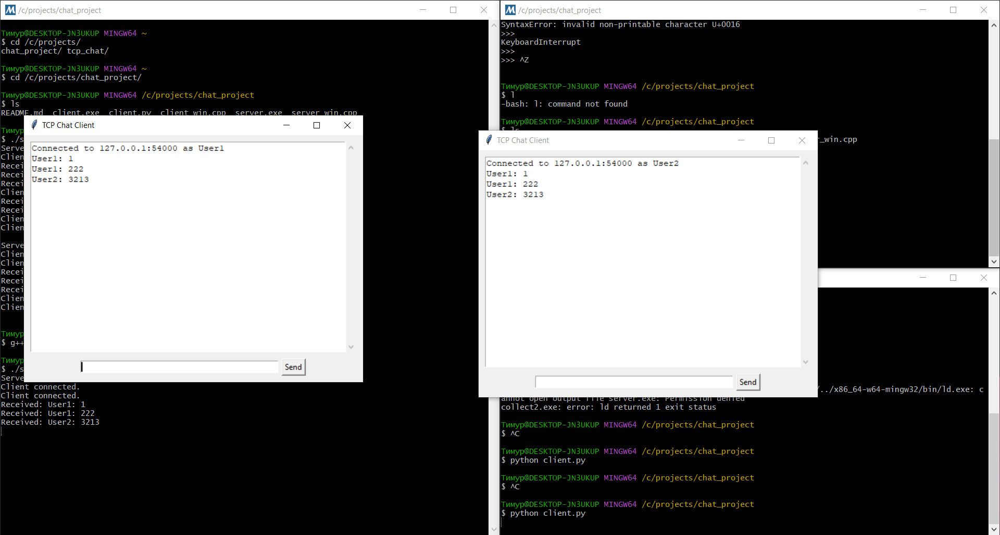

# 🗨️ TCP Chat Project v0.2

Многопользовательский чат:  
- Асинхронный многопоточный TCP-сервер на **C++ (WinSock2)**  
- Кроссплатформенный клиент на **Python** с GUI (Tkinter)  
- Работает через **MSYS2 MinGW-w64** (сервер) и Python 3.8+ (клиент)

---

## 📸 Пример работы



---

## 📂 Структура проекта

├── server_win.cpp # Сервер на C++ с WinSock2 и std::thread
├── client.py # Клиентская часть на Python (Tkinter)
├── example.png # Скриншот работы
├── README.md # Документация


---

## ⚙️ Требования

### ✅ Сервер:
- Windows 10/11
- [MSYS2](https://www.msys2.org/) + `mingw-w64-x86_64-gcc`
- Компилятор: `g++` с поддержкой `WinSock2`

### ✅ Клиент:
- Python 3.8+
- Tkinter (встроен)
- Рекомендуется: виртуальное окружение

---

## 🛠️ Сборка сервера (MSYS2)

1️⃣ Запусти `MSYS2 MinGW 64-bit`  
2️⃣ Перейди в папку проекта:
```bash
cd /c/projects/chat_project
```
3️⃣ Собери:
```bash
g++ -std=c++17 server_win.cpp -o server.exe -lws2_32 -pthread
```
4️⃣ Запусти:
```bash
./server.exe
```

---

## 🚀 Запуск клиента
1️⃣ Установи зависимости (если нужно):
pip install tk
2️⃣ Запусти клиента:
python client.py

При старте укажи имя пользователя. Открой несколько окон client.py — клиенты будут видеть сообщения друг друга.

---

## ⚙️ Особенности
1. Сервер работает через WinSock2 — только для Windows.
2. Передача сообщений TCP.
3. Многопоточность: каждый клиент обрабатывается отдельным потоком.
4. Python GUI на Tkinter.
5. Есть пример скриншота example.png.

---

## 📌 Заметки по версии v0.2
1. Можно подключать несколько клиентов.
2. Сервер шлёт сообщения всем клиентам, включая отправителя.

---

## 📜 Лицензия
MIT License — свободно используйте и модифицируйте.

---

# 👤 Контакты
Автор: nerooon123